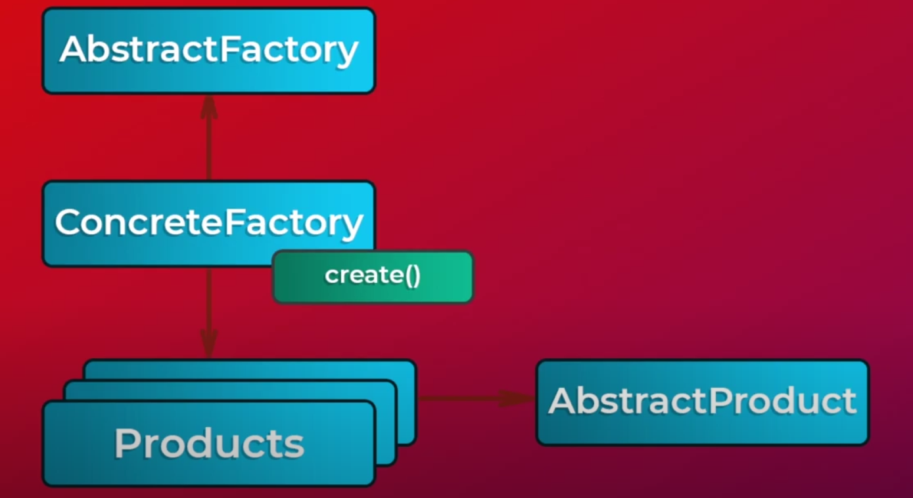

# Абстрактная фабрика — это порождающий паттерн проектирования, который решает проблему создания целых семейств связанных продуктов, без указания конкретных классов продуктов.
# Абстрактная фабрика задаёт интерфейс создания всех доступных типов продуктов, а каждая конкретная реализация фабрики порождает продукты одной из вариаций. Клиентский код вызывает методы фабрики для получения продуктов, вместо самостоятельного создания с помощью оператора new. При этом фабрика сама следит за тем, чтобы создать продукт нужной вариации.

